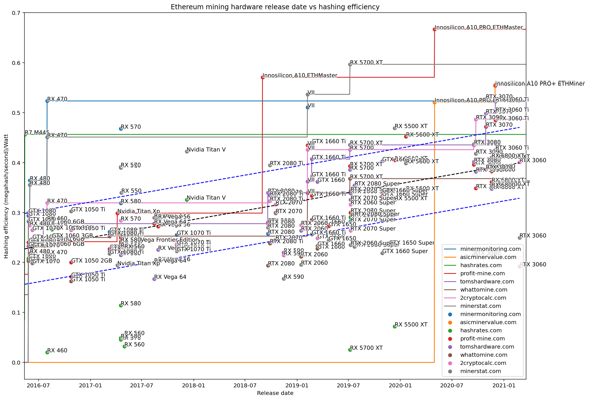
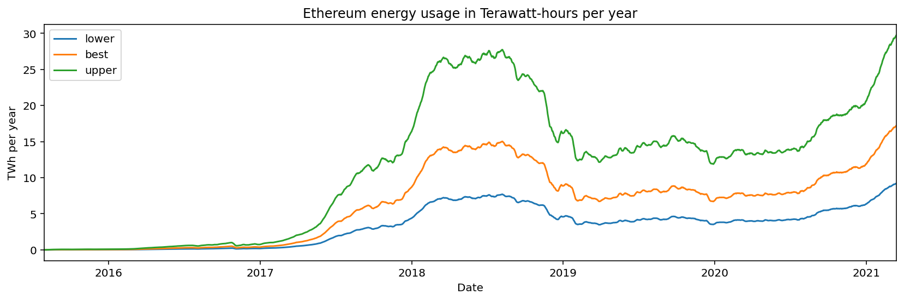

# Ethereum Energy Consumption

An attempt to estimate the per-day energy consumption of Ethereum, with the ultimate goal of estiming the daily kgCO2 per gas.

Inspired by:

- [Energy Consumption of Cryptocurrencies Beyond Bitcoin](https://www.cell.com/joule/fulltext/S2542-4351(20)30331-7) (2020) by Gallersdörfer et al.
- [Quantification of energy and carbon costs for mining cryptocurrencies](https://www.nature.com/articles/s41893-018-0152-7) (2018) by Krause et al.

The general principle is: divide the total hash rate of Ethereum by the hashing efficiency (hashrate per watt) for the average GPU.

Note that I use "efficiency" to refer to hashing speed divided by power usage, not power usage divided by hashing speed. This is based on the idea that a larger number should correspond to "more efficient" hardware.

# Process

First I collected all the different benchmarks for various hardware from a variety of sources.

Then I estimated the power usage while mining for GPUs that had hashrate estimates, but did not have any available power benchmark.

Then I estimated the average increase over time in hashing efficiency across all GPUs that are commonly benchmarked. I used Wikipedia as a reference for the GPU release dates.

Finally, I divided the Ethereum network hashrate by the daily efficiency estimate, and accounted for other fixed factors like power supply efficiency.

## Benchmark Sources

I draw hash rates from multiple sources:

- [minermonitoring.com](https://minermonitoring.com)
- [asicminervalue.com](https://asicminervalue.com)
- [hashrates.com](https://hashrates.com)
- [profit-mine.com](https://profit-mine.com/)
- [2cryptocalc.com](https://2cryptocalc.com/)
- [minerstat.com](https://minerstat.com/)
- [whattomine.com](https://whattomine.com/)
- [tomshardware.com](https://tomshardware.com/)

The code for scraping 2cryptocalc, minermonitoring, minerstat, and profit-mine are available in the `source/` folder. Others were manually scraped.

## Estimating GPU power

GPUs are listed at a nominal max power, provided by Wikipedia and stored in `data/reference.csv`. When hashing, they do not always use all the available power. To estimate power for GPUs that only have a nominal power available, I estimate that the average GPU is only running at around 70% nominal power when hashing. This only applies in a few cases. This estimate is made in `Nominal vs True Power.ipynb`

## Estimating GPU efficiency

Historical and present GPU efficiency is difficult to estimate without access to that GPU. Efficiency depends on hashrate and power usage, and both of these numbers are connected to a variety of factors.

The size of the DAG and the RAM of the GPU affects the hashrate. [A larger DAG may pressure the GPU](https://www.techspot.com/article/1438-ethereum-mining-gpu-benchmark/) causing the GPU to underperform. Because the DAG size is always growing, this means that benchmarks at one moment in time may not be applicable to another moment in time. Also, this puts a natural lifespan on GPUs. GPU RAM of the following sizes renders a card [unusable by these dates](https://minerstat.com/dag-size-calculator):

- 5GB: 9 Aug 2022 7:44
- 4GB: 24 Dec 2020 10:24
- 3GB: 11 May 2019 13:04
- 2GB: 25 Sep 2017 15:44
- 1GB: 10 Feb 2016 18:24

Hashrates are dependent on software configuration, with recent software sometimes hashing faster on the same hardware than older software. Power is also connected to software, with some software providing the same hashrate at a lower or higher power.

GPUs are often overclocked by miners. This may increase both the hashrate and the power usage.

Some papers look at a single set of benchmarks and take the best-performing card at any moment to estimate the lower bound for the whole network's usage. Because efficiency estimates vary wildly from source to source, I've compiled estimates across many sources and assumed their benchmarks are representative of the kinds of hashrates and power use that miners tend to achieve.

The real-world benchmarks from minermonitoring.com land towards the upper middle region this plot, which indicates that it is a reasonable assumption.

## Estimating energy consumption

Because my goal is to eventually estimate emissions, I want to calculate the energy usage from the perspective of the power plant. This means including:

- Grid efficiency. Transmission and distribution losses [vary from 5-10%](http://insideenergy.org/2015/11/06/lost-in-transmission-how-much-electricity-disappears-between-a-power-plant-and-your-plug/) in many places.
- Cooling and other operational overhead, as power usage effectiveness. This can be anywhere from 1-20% of a datacenter's energy usage.
- Power supply efficiency. Some AC-DC power supplies are only 65-70% efficient, but the best ones can perform at 95-96%.
- Additional computational power usage from non-GPU components. Unlike ASIC miners, the GPU power is just part of the cost. In a home rig with a single GPU running at 150W, an additional 60W might be dedicated to the CPU. On a farm with more GPUs per CPU, the overhead is lower.
- A small offset in hashing efficiency is used to control for a conservative and liberal treatment of my GPU efficiency estimate. Taking the mean absolute error of the line fit as a guide, I add the error to the efficiency estimate to get a lower bound on power usage, and subtract the error to get an upper bound on power usage.

I compute three variations, inspired by [CBECI](https://cbeci.org/) but without the same profit-based rigor. This gives a best guess estimate of 17.2 TWh/year on 2021-03-15.

